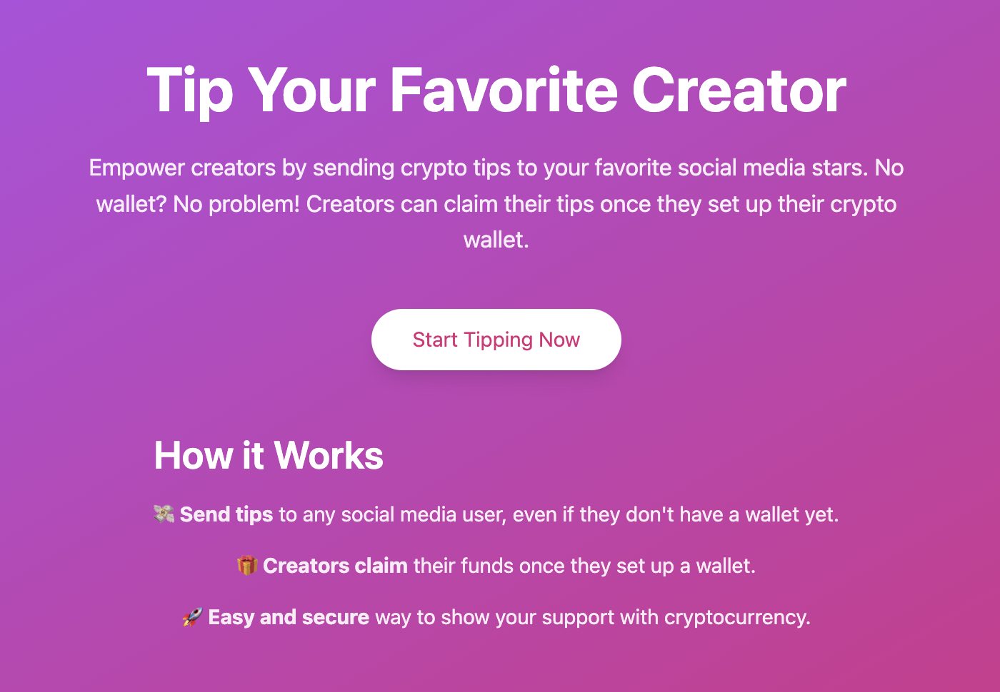
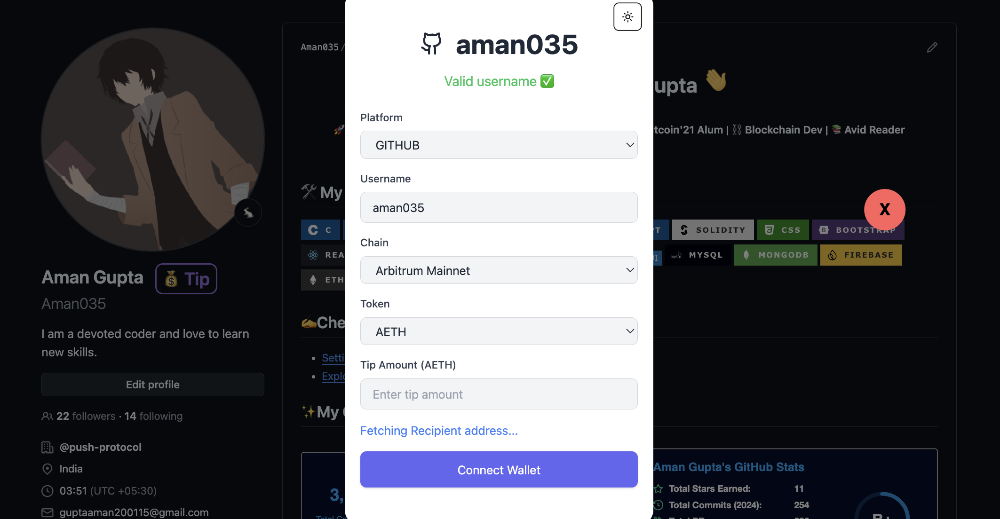
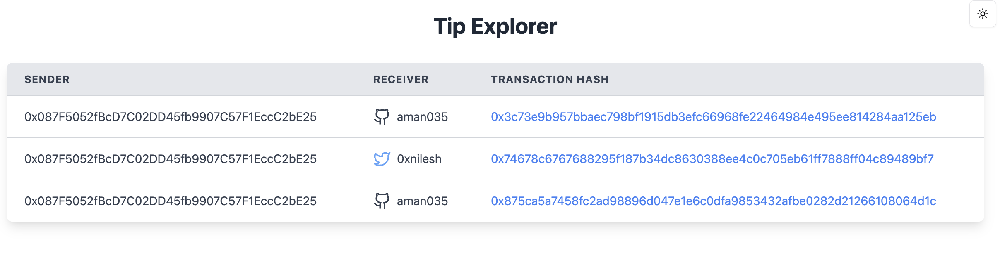

# Tipsy - The Next-Gen Tipping Platform

## 🚀 Introduction

**Tipsy** is a next-gen platform designed to make tipping your favorite creators on **X (formerly Twitter)** and **GitHub** seamless, intuitive, and secure. By integrating blockchain technology, **Tipsy** transforms how fans can support creators online.

With the **Tipsy Extension**, tipping becomes as easy as liking or retweeting. Whether you're on X or GitHub, you can effortlessly send tips to your favorite creators with just a few clicks.

Empower creators and show your appreciation by sending tips—without any friction.

---

## 📦 Features

### **For Tippers:**

1. **Install the Tipsy Extension**:

   - Simply install the browser extension and you're ready to start tipping! The extension integrates directly into your browsing experience on X and GitHub.

2. **Find Your Favorite Creator**:

   - While browsing profiles, the extension adds a “Tip” button to supported profiles.

3. **Send a Tip**:
   - Select the amount, token, and blockchain to send the tip. Confirm the transaction, and it’s sent to the creator's pregenerated wallet.

### **For Creators:**

1. **Pregenerated Wallets**:

   - Every creator gets a pregenerated wallet linked to their profile, where all the tips are received.

2. **Claiming Funds**:

   - Creators can log in at any time to claim their accumulated tips.

3. **Preference Setup**:
   - Creators can configure their preferred token and blockchain to streamline future payments.

---

## 🛠️ How It Works

### **1. Wallet Management with Capsule**

- **Wallet Association**: Every creator on GitHub or X has a pregenerated wallet linked to their profile using the **Capsule Protocol**.
- **2/2 Multi-Party Computation (MPC)**: The wallet is managed securely using a **2/2 MPC** service, where the private key is split between two parties (Capsule Network and Tipsy). Both parties must sign a transaction to approve any wallet actions, ensuring that no single entity can control the wallet, thus enhancing security until the user claims the wallet.

### **2. Token Swapping via CowSwap**

- When a tip is sent in a different token than the recipient’s preference on the same chain, **CowSwap** ensures the swap is executed efficiently.
- **How CowSwap Works**: It acts as a decentralized exchange aggregator, finding the best liquidity across multiple DEXs. This minimizes slippage and ensures that the recipient receives the correct token as per their preferences, whether they prefer USDC, ETH, or any other token.

### **3. Cross-Chain Bridging via 1inch Fusion Swap**

- If the tip is sent on a different chain than the recipient’s preferred one, **1inch Fusion Swap** facilitates the bridging.
- **How Fusion Swap Works**: 1inch’s Fusion technology automatically detects the best route for bridging funds between blockchains. It ensures that funds are transferred securely and quickly across various chains, converting the tip into the preferred token on the recipient’s chosen chain.

### **4. Connecting Wallets for Tipping via Privy Provider**

- **Privy Provider** is used to connect wallets for sending tips. It allows users to interact with the blockchain in a secure and seamless way, ensuring that tippers can send tips effortlessly. The Privy Provider serves as the bridge between the user's wallet and the platform, ensuring secure wallet interactions.

### **5. Monorepo Architecture**

- The project is built using a **monorepo structure** with three main directories:
  - **Nest Backend**: Handles all backend logic, including wallet creation, management, and claiming of wallets.
  - **Vite Frontend**: Provides the user interface for tipping, including wallet integration, tip sending, and preference configuration for creators. The frontend is built with **Vite** for fast, modern web development.
  - **Extension**: A browser extension that integrates directly into X and GitHub profiles, enabling users to send tips easily with just one click. The extension adds the tipping functionality directly to profiles, making it seamless for users to support their favorite creators without leaving the platform.

---

## 📸 Screenshots








---

## 🔧 Installation

### 1. **Clone the Repository**

```bash
git clone https://github.com/your-username/tipsy.git
```

### 2. **Install Frontend**

```
cd tipsy/frontend
npm install
npm run dev
```

### 3. **Install Backend**

```
cd tipsy/backend
npm install
npm run start
```

### 4. **Install Extension**

- Go to `chrome://extensions/` in your browser.
- Enable Developer Mode.
- Click on "Load Unpacked" and select the `tipsy/extension` directory.
